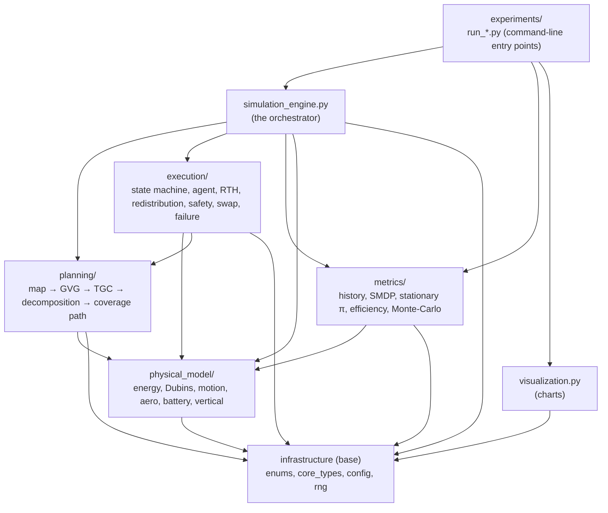
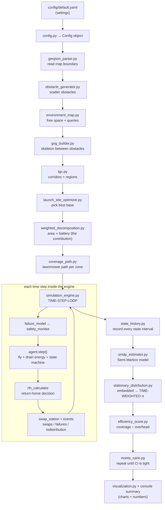

# Project Guide — UAV Swarm Reconnaissance Simulation

*A return-in-a-year manual for the Part III thesis simulation. Written for someone who knows the thesis cold but is a Python novice. No assumptions: where I am not 100% certain, I say so in **[SCREAMING NOTES]**.*

A note on my confidence: I authored and tested every file in this project, and the full suite of 103 automated tests passes. So for **"what does each file do"** my confidence is high. My genuine blind spots are not *what* the code does but whether a handful of deliberate **simplifications** are good enough to support a thesis conclusion. Those are flagged honestly throughout.

---

## 1. High-Confidence Overview

**What it is.** A discrete-time, Monte-Carlo simulation of a swarm of *identical* reconnaissance drones that together cover a mapped area. It exists to test the thesis's central idea — **energy-weighted spatial decomposition**: divide the area among drones so each drone's patch is sized in proportion to how much battery it has right now, on a topological-graph framework that works around obstacles — and to *prove* properties of that idea with a stochastic (Semi-Markov) analysis.

**What one run does, in plain terms.**
1. Reads a map boundary (a GeoJSON file) and scatters synthetic obstacles into it.
2. Builds a "skeleton" of the free space between obstacles (the GVG), condenses it into navigable regions (the TGC).
3. Picks the best **launch site** (treated as a decision, not a given).
4. **Divides** the area among the drones (the central contribution; baselines available for comparison).
5. Plans a back-and-forth "lawnmower" coverage path inside each drone's patch.
6. **Flies** every drone forward in small time steps under a 7-state behaviour automaton (idle → transit → cover → return-to-home → battery-swap, plus obstacle-avoid and failure), draining energy as power × time, returning to swap batteries when the live "can I still make it home?" calculation says so.
7. **Measures** the result two ways: deterministic numbers (total energy, mission duration, how evenly work was shared) and a **stationary distribution** — the long-run fraction of time the swarm spends in each state — from which it computes an **efficiency score** (useful coverage time ÷ overhead time).
8. Repeats many times (Monte-Carlo) until the efficiency estimate is statistically stable.

**How the major pieces interact.** Five layers, each a Python *package* (a folder):

- **infrastructure** — settings, randomness, shared data types, the **orchestrator** that runs everything, and chart drawing.
- **physical_model** — the physics: energy, flight geometry (Dubins curves vs. free-flying), aerodynamic drafting, battery, takeoff/landing.
- **planning** — turning the map into regions and dividing them among drones; the boustrophedon coverage path.
- **execution** — the per-drone behaviour: the state machine, the agent's per-tick logic, return-to-home, redistribution after a failure, safety, swaps, failures.
- **metrics** — the analysis: recording what happened, estimating the Semi-Markov model, computing the stationary distribution and efficiency, Monte-Carlo, and comparisons.

The single conductor is **`simulation_engine.py`**: it builds the pipeline, runs the time loop, and hands the recorded history to the metrics layer. The `run_*.py` scripts are thin command-line front doors that call the engine for specific experiments.

**The one number to remember.** Energy is *always* power × time, never a per-distance shortcut. Many design choices exist to protect that and the "area ∝ battery" guarantee.

---

## 2. Hierarchical File Structure & Directory Tree

**Read this first — it is the most important practical fact in this document:**

> **[WARNING: THE PROJECT IS NOT FLAT.]** These 60 files are **not** meant to sit together in one folder. 45 of them use *relative imports* (lines like `from ..infrastructure.config import Config`). Those imports only work when each file sits inside its correct sub-folder of the package `src/uav_swarm_sim/`. If you drop all 60 files into one directory, **nothing will import and nothing will run.** Keep the tree below intact.

> **[WARNING: HIDDEN FILES NOT IN YOUR LIST OF 60.]** The project also needs files your list omitted but that are essential: seven `__init__.py` files (one per package folder — they mark a folder as an importable Python package; most are short), `tests/conftest.py` (lets the tests find the code), `pyproject.toml` and `requirements.txt` (installation), two map files in `data/areas/`, and `config/scenarios/smoke.yaml` (a fast test map). If any `__init__.py` is missing, that whole folder stops importing.

> **[WARNING: `tgc_basic` IS NOT A FILE.]** You may look for `tgc_basic.py` and not find it. The `tgc_basic` baseline is a *class* named `TgcBasicDecomposer` living **inside `weighted_decomposition.py`**. That is intentional (it is the "weighting switched off" twin of the central method, kept next to it so they can't drift apart).

Exact directory tree (verified on disk):

```
uav-swarm-sim/                         ← repository root; RUN COMMANDS FROM HERE
├── README.md                          ← project intro + run instructions
├── ARCHITECTURE_BLUEPRINT.md          ← the full design spec (not in your 60-file list)
├── pyproject.toml                     ← tells "pip install" how to install the package
├── requirements.txt                   ← the list of external libraries needed
├── config/
│   ├── default.yaml                   ← all settings for a full-size run (2 km area)
│   └── scenarios/
│       └── smoke.yaml                 ← settings for a fast, small test run
├── data/
│   └── areas/
│       ├── example_area.geojson       ← the full-size map boundary
│       └── smoke_area.geojson         ← a tiny map boundary for fast runs
├── src/
│   └── uav_swarm_sim/                 ← the actual Python package
│       ├── __init__.py
│       ├── infrastructure/
│       │   ├── __init__.py
│       │   ├── enums.py
│       │   ├── core_types.py
│       │   ├── config.py
│       │   ├── rng.py
│       │   ├── simulation_engine.py
│       │   └── visualization.py            ← + optional comm-range overlay (VizConfig)
│       ├── physical_model/
│       │   ├── __init__.py
│       │   ├── drone_specs.py
│       │   ├── battery.py
│       │   ├── energy_model.py
│       │   ├── aero_correction.py
│       │   ├── dubins.py
│       │   ├── motion_model.py
│       │   ├── vertical_segments.py
│       │   └── metrics_definitions.py
│       ├── planning/
│       │   ├── __init__.py
│       │   ├── geojson_parser.py
│       │   ├── obstacle_generator.py
│       │   ├── environment_map.py
│       │   ├── gvg_builder.py
│       │   ├── tgc.py
│       │   ├── decomposition_base.py
│       │   ├── weighted_decomposition.py   ← also contains TgcBasicDecomposer
│       │   ├── classic_voronoi.py
│       │   ├── kmeans_heuristic.py
│       │   ├── launch_site_optimizer.py
│       │   ├── coverage_path.py
│       │   ├── grid_planner.py
│       │   ├── target_mission.py           ← target-visit missions (tour planning)
│       │   └── dynamic_obstacles.py        ← moving (bird-like) obstacles
│       ├── execution/
│       │   ├── __init__.py
│       │   ├── state_machine.py
│       │   ├── agent.py
│       │   ├── fleet.py
│       │   ├── events.py
│       │   ├── rth_calculator.py
│       │   ├── redistribution.py
│       │   ├── safety_monitor.py
│       │   ├── formation_manager.py
│       │   ├── swap_station.py
│       │   ├── failure_model.py
│       │   ├── algorithm_selector.py
│       │   └── sensing.py                  ← swarm passive/active dynamic-obstacle sensing
│       ├── metrics/
│       │   ├── __init__.py
│       │   ├── state_history.py
│       │   ├── mission_metrics.py
│       │   ├── smdp_estimator.py
│       │   ├── stationary_distribution.py
│       │   ├── efficiency_score.py
│       │   ├── convergence.py
│       │   ├── monte_carlo.py
│       │   ├── comparison.py
│       │   └── validation.py
│       └── experiments/
│           ├── __init__.py
│           ├── run_single_mission.py
│           ├── run_decomposition_comparison.py
│           ├── run_kinematics_comparison.py
│           ├── run_scale_tiers.py
│           ├── run_launch_site_study.py
│           └── run_replay.py               ← deterministic GIF/PNG replay of one replication
└── tests/
    ├── conftest.py                    ← test setup (finds the code; config_path fixture)
    ├── unit/                          ← isolated per-package tests, mirrors src/
    │   ├── execution/  experiments/  infrastructure/
    │   └── metrics/    physical_model/  planning/
    ├── integration/                   ← engine runs / cross-layer tests
    └── e2e/                           ← full harness + CLI entry-point tests
```

I am **not** suggesting any change to the files. The tree above is how they already are and must stay.

---

## 3. File-by-File Dictionary

Plain-language description of every file. Domain terms (TGC, Dubins, SMDP) are used freely since you know them; I explain the *software* role. **[SCREAMING NOTES]** flag genuine uncertainty or caveats.

### Settings & shared vocabulary (infrastructure)

- **enums.py** — the fixed name-lists used everywhere: platform types (FIXED_WING / MULTIROTOR / VTOL), the 7 states, maneuver types, battery zones (HIGH/NOMINAL/CRITICAL/TERMINAL), the three decomposition labels. One home so names never drift.
- **core_types.py** — the shared "nouns" passed between parts: a `Pose` (x, y, heading), a `Path` (made of straight/curved segments, walkable by time or by distance), a `Region`/`Zone`/`Partition`, a `CoveragePlan`, an `Event`, and the final `MissionResult`. Pure data containers plus the geometry math to interpolate along a path.
- **config.py** — reads a `.yaml` settings file into strongly-typed Python objects, converts units once (Watt-hours → Joules, degrees → radians), validates everything (e.g. refuses a fixed-wing with zero turn radius), and stamps a fingerprint (`config_hash`) so you can prove which settings produced a result.

  > **New configuration groups (added with recent features):**
  > - `mission:` — `type: coverage | target_visit` (default `coverage`); for target missions, `n_targets` or explicit `target_coordinates`, and `weight_targets_by_battery`.
  > - `dynamic_obstacles:` — `enabled` (default **false**, the master switch), `count`, `speed_m_s`, `size_m`, `passive_sense_range_m`, `active_sense_range_m`, `active_scan_power_w`, `dynamic_hold_s`.
  > - `viz:` — **view-only** overlay options (no effect on the simulation): `show_comm_range` (default **false**), `comm_range_m`, `comm_range_alpha`, `comm_range_dashed`.
  >
  > **Turning on the comm-range circle:** set `show_comm_range: true` in the `viz:` block of `config/default.yaml` (or your scenario file), then run any experiment that renders — e.g. `python -m uav_swarm_sim.experiments.run_single_mission --config config/default.yaml --out runs/demo`. The replay GIF and the state-colored path PNG will then draw a dashed, low-opacity circle of radius `comm_range_m` around each drone. Set it back to `false` to remove the overlay; nothing else changes. Use `comm_range_dashed: false` for a translucent filled disc instead of a dashed outline, and `comm_range_alpha` to tune opacity.
- **rng.py** — the randomness factory. One master seed fans out into independent named streams ("obstacles", "failures", …) so runs are exactly repeatable and so two algorithms compared at the same replication see the *same* random map and failures (a fair, paired comparison).
- **simulation_engine.py** — **the conductor.** Builds the whole pipeline, runs the time-step loop, routes events (failure → redistribute, swap-request → station, etc.), decides when the mission is complete, and packages the result. If you read one file to understand control flow, read this one.
- **visualization.py** — draws every chart (map, partition, trajectories, per-drone state timeline, battery curves, the embedded-vs-time-weighted bar chart, Monte-Carlo convergence) as PNG files. Pure "data in, picture out". Also renders the 2D replay GIF and the state-colored path PNG, and — **only when `viz.show_comm_range` is true** — draws a dashed, low-opacity communication-range circle around each drone (see VizConfig under Settings). The overlay is purely visual and defaults to OFF.

### Physics (physical_model)

- **drone_specs.py** — assembles the single homogeneous drone specification (speeds, turn radius, power table, battery size, effective sensor width) from the config. Homogeneity is enforced here.
- **battery.py** — one drone's energy tank: drains (clamped at 0), resets to full on swap, and reports which of the four battery zones it's in.
- **energy_model.py** — the grey-box energy model. Converts a maneuver held for a duration into Joules as **power × time**. Applies the drafting discount **only** to cruise on fixed-wing/VTOL — never to coverage, never to multirotor.
- **aero_correction.py** — the formation drafting effect: returns the ~15% power discount when (and only when) a follower is in formation, cruising, and fixed-wing/VTOL; also produces the downwash "wake zones" that multirotors must treat as invisible obstacles.
- **dubins.py** — shortest flyable curves between two oriented points for aircraft that can't turn on a dime (fixed-wing/VTOL). **[NOTE: it is self-checking — it rebuilds each candidate curve and verifies it lands exactly on the goal before accepting, so a formula slip can't return a wrong path. I trust this one; it is tested against 200 random cases.]**
- **motion_model.py** — the steering abstraction: `DubinsModel` for fixed-wing/VTOL (curved paths), `HolonomicModel` for multirotor (turn-in-place + straight). Everything downstream is platform-agnostic because it goes through this.
- **vertical_segments.py** — takeoff and landing modeled as separate 1-D up/down segments (multirotor/VTOL) or a sloped climb-out plus ground-roll energy (fixed-wing). Implements the thesis's "coverage at constant altitude, verticals handled separately" split.
- **metrics_definitions.py** — the platform-independent definitions of the three deterministic metrics (total energy, duration, workload standard deviation). Small; the actual computation is in `mission_metrics.py`.

### Map → regions → division (planning)

- **geojson_parser.py** — reads the map boundary file into a geometric polygon; projects lat/long maps into meters. **[WARNING: a *very small* metric map (< ~180 m across) could be mistaken for lat/long and silently shrunk. The supplied maps are large enough that this doesn't bite, but if you ever feed a tiny metric map, check the result.]**
- **obstacle_generator.py** — scatters obstacles using a Poisson process, merges overlaps, and rejects layouts that cut the free space into disconnected pieces.
- **environment_map.py** — the single source of spatial truth: free space, distance-to-nearest-obstacle, "is this segment clear?", an occupancy grid, and random free-point sampling.
- **gvg_builder.py** — builds the Generalized Voronoi Graph: the skeleton running equidistant between *distinct* obstacles. With zero obstacles it is intentionally empty (the next file copes).
- **tgc.py** — condenses the skeleton into navigable corridors and carves the free space into **regions** (the atomic patches that get assigned to drones). **[NOTE: region *areas* are exact Shapely areas, but region *shapes* are an approximation and can overlap by ~0.2%. This is documented and intended; see the caveat under `weighted_decomposition.py`.]**
- **decomposition_base.py** — the shared contract every "divide the area" algorithm obeys, plus helpers: build an adjacency graph of regions, subdivide regions when there are fewer regions than drones, assemble a drone's zone, and measure imbalance.
- **weighted_decomposition.py** — **THE CENTRAL CONTRIBUTION.** Grows each drone's zone so its area is proportional to that drone's current battery, keeping zones connected and the areas matching their targets. Also contains `TgcBasicDecomposer` (the equal-weight baseline). **[WARNING — the most important caveat in the project: with all batteries full, weighted and tgc_basic give identical results *by design* (equal battery → equal area). The weighting only visibly differs when batteries differ — i.e. at a redistribution after a failure, or if a run starts with unequal charge. So a clean no-failure run will NOT showcase the contribution. To demonstrate it you must run a scenario where batteries diverge.]**
- **classic_voronoi.py** — baseline 1: plain nearest-drone Voronoi split, ignoring battery and obstacle topology. The "naïve" foil.
- **kmeans_heuristic.py** — the ≤15-drone tier: k-means clustering of the work plus greedy drone-to-cluster assignment on a flight-cost matrix.
- **launch_site_optimizer.py** — picks the launch site by three criteria (mean distance to zones, formation-corrected initial energy, expected swaps). **[WARNING: the "expected swaps" term uses only transit+return energy, not the full coverage energy of a zone, so in practice it often evaluates to 0 and contributes little. If criterion 3 looks inert in your results, this is why — it is a known simplification, not a bug.]**
- **coverage_path.py** — the boustrophedon ("lawnmower") path inside one zone: strips along the long axis, U-turn connectors planned by the motion model, with a guard that interleaves strips when the turn radius is too big for a tight U-turn.
- **grid_planner.py** — the deliberately "dumb" grid-based comparison planner (no curvature) used to quantify the speed-vs-realism trade-off against Dubins, plus a grid A* router.
- **target_mission.py** — the discrete-point counterpart of area coverage. Generates targets (explicit coords or seeded random free points), allocates them to drones with **count proportional to battery** (the same contribution applied to a different work unit), routes each subset into a nearest-neighbour + 2-opt tour, and emits a `CoveragePlan` with `leg_mode="tour"`. Selected via `mission.type: target_visit`; the whole execution + SMDP stack is reused unchanged.
- **dynamic_obstacles.py** — drone-sized moving obstacles (e.g. birds). A configured `count` spawn at random free positions and travel at a fixed `speed_m_s` in a random direction, reflecting off the area boundary. Position is advanced once per tick by the engine; seeded → reproducible.

### Per-drone behaviour (execution)

- **state_machine.py** — the 7-state automaton: the legal transitions, the guard conditions, and the closed loop (return → swap → idle). Failure pre-empts from any flying state. **[NOTE: failure is terminal *here* (physical layer); the "replacement" that closes the loop for the math lives in the metrics layer — see `smdp_estimator.py`.]**
- **agent.py** — one drone's per-time-step logic: which leg of which path it's flying, draining energy, checking return-to-home periodically, and applying state transitions. Tracks cumulative energy (survives battery swaps) and distance flown.
- **fleet.py** — the container of all drones; `active()` excludes failed ones; `kill()` removes a failed drone permanently.
- **events.py** — a simple in-order message bus (failure, new-task, swap-request, swap-done, …). Only failure and new-task trigger redistribution; swaps deliberately do not.
- **rth_calculator.py** — the dynamic return-to-home decision: "do I have enough energy for the next strip *and* the trip home plus a small reserve?" Replaces a fixed % reserve. **[WARNING: the obstacle detour for the homeward trip is approximated by a flat 1.5× factor rather than real routing. In tight obstacle fields this could make the return estimate slightly optimistic.]**
- **redistribution.py** — on a failure or new task, re-divides the affected work among the surviving active drones using the weighted decomposer (reading current batteries). **[WARNING: when it re-tasks a drone that was mid-coverage, the in-progress coverage of its old zone is dropped and it re-transits to the new zone. This is a documented simplification; after a failure the coverage accounting is therefore approximate.]**
- **safety_monitor.py** — proactive avoidance: predicts each drone's near-future positions and triggers a sidestep on genuine obstacle penetration or (for dispersed drones) on predicted close approach or wake intrusion. **[NOTE: inter-drone conflicts are *ignored during formation phases* (the formation manager handles spacing there) and there is a per-drone cooldown. This was necessary to stop launch/return "thrashing". It is reasonable, but it means two drones in formation are not collision-checked against each other — fine for this model, worth stating in the thesis.]**
- **formation_manager.py** — decides who is in formation when (transit/return yes, coverage never), which gates the drafting discount. **[NOTE: it is a simplified model — a follower gets the discount, the leader does not; spacing/echelon geometry is approximated.]**
- **swap_station.py** — the battery-swap queue at base: limited bays, a service time, emits "swap done". Waiting time counts as swap-state time (so it shows up in the efficiency score).
- **failure_model.py** — random drone failure at a configurable hourly hazard rate. With the rate set to 0, no failures happen (and the failure state never appears).
- **algorithm_selector.py** — the three-tier rule (≤15 heuristic / 16–49 compare both / ≥50 TGC) and the factory that builds the chosen decomposer(s).
- **sensing.py** — the swarm-level passive/active sensing coordinator. Each tick it checks whether any airborne drone has a dynamic obstacle within the current detection range (short when PASSIVE, long/LIDAR when ACTIVE); the **first detection flips the whole swarm to ACTIVE**, which drains `active_scan_power_w` from every airborne drone and reverts after `dynamic_hold_s` of quiet. A near-miss signals the existing S_OBS graceful maneuver. An obstacle that never enters any drone's passive range is simply never noticed. OFF unless `dynamic_obstacles.enabled` is true.

### Analysis (metrics)

- **state_history.py** — the recorder: every drone's sequence of (state, time-in, time-out). This is the raw evidence the whole analysis is built on.
- **mission_metrics.py** — computes the three deterministic numbers (energy, duration, workload std) plus swap/failure counts and coverage fraction. **[WARNING: coverage fraction is coarse — it counts a drone's whole zone as "covered" once that drone finishes, in jumps. It is fine for "did the mission finish", but don't read it as a fine-grained percentage. Also: at the time-step limit a nearly-finished mission can be marked aborted.]**
- **smdp_estimator.py** — turns the recorded history into a Semi-Markov model: the jump-chain transition matrix and the mean time spent per state. **Hosts the failure dual-view**: a switch (`close_failure_loop`) that, when on, adds a synthetic "failed → replaced → idle" transition so the chain is ergodic (required for the next step); when off, refuses, exactly as it should.
- **stationary_distribution.py** — computes the long-run distribution two ways: the **embedded** one (how *often* each state is visited) and the **time-weighted** one (what *fraction of time* is spent in each state). **[NOTE: the time-weighting step is the subtle, easy-to-get-wrong correction the thesis depends on; it is implemented and tested with a hand-computed example.]**
- **efficiency_score.py** — the headline scalar: coverage time ÷ (return + avoidance + swap time), on the time-weighted distribution. Idle and failure time are excluded.
- **convergence.py** — the Monte-Carlo stopping rule: stop when the 95% confidence interval of the tracked quantity is tight enough.
- **monte_carlo.py** — runs many replications until convergence (or a cap) and aggregates means and confidence intervals. Deliberately decoupled from the engine (it takes a "run one replication" function), which is why it could be tested on its own.
- **comparison.py** — the paired head-to-head harness (classic vs tgc_basic vs weighted; Dubins vs grid; across fleet sizes), reusing the same random seeds for fairness. **[WARNING: this is wired and runs, but the realistic, publication-grade scenarios are not fully populated — treat the numbers from a tiny run as a plumbing check, not a result.]**
- **validation.py** — compares the simulation's aggregate behaviour against published figures from the cited papers, giving directional PASS/FAIL/INFO verdicts. **[WARNING: the verdict logic is implemented and tested, but the real comparison numbers must be fed in from full-scale runs (the Batch-6 harness) — by itself this file does not yet reproduce the papers.]**

### Command-line front doors (experiments)

- **run_single_mission.py** — run one mission, print a summary line, and dump all the charts. The "defense demo".
- **run_decomposition_comparison.py** — the headline experiment: classic vs tgc_basic vs weighted.
- **run_kinematics_comparison.py** — Dubins vs grid (refuses multirotor, where the comparison is meaningless).
- **run_scale_tiers.py** — sweep fleet sizes to study the tier break-even.
- **run_launch_site_study.py** — rank candidate launch sites and print the table.

### Settings file & docs

- **default.yaml** — every setting for a full run, with comments explaining the non-obvious values (the three per-platform power tables, the deliberately-elevated failure rate, the battery-zone thresholds 0.75/0.40/0.20, etc.).
- **README.md** — the project's own front-page: what it is, the layer map, install/run instructions, the platform caveat, the failure dual-view note, and the "extension points for the thesis text" section.

### Tests (your safety net)

- **tests/unit/** — isolated per-package tests mirroring `src/` (infrastructure: config/rng/core_types; physical_model: energy/Dubins/battery/motion; planning; execution: state machine/agent/fleet; metrics: SMDP; experiments: analytical harnesses). They pin the important properties (energy = power×time, Dubins endpoints, area ∝ battery, legal transitions, the embedded-vs-time-weighted correction, determinism).
- **tests/integration/test_smoke.py** — the end-to-end check: a tiny 3-drone mission must complete, cover its area, end with all drones idle, and produce a valid stationary distribution. **If you change anything in a year, run this first.**

**[GENERAL HONESTY NOTE]** I am confident about *what every file does*. My real uncertainty is concentrated in five places, all flagged above: `launch_site_optimizer` (criterion 3 often inert), `redistribution` (drops in-progress coverage), `mission_metrics` (coarse coverage fraction), `comparison`/`validation` (plumbing present, full scenarios not populated), and the headline fact that **the central contribution only shows its effect when batteries differ**. None of these are crashes; all are modelling choices to be aware of when you write results.

---

## 4. Execution & Setup Instructions

This is a **command-line research tool**, not an app with buttons. "Running it" means typing commands in a terminal. Below: what to install, how to run with Python, and three options if you don't have Python.

### 4.0 What you need pre-installed (both Windows and macOS)
- **Python 3.12 or newer.** This is the only hard requirement.
- The external libraries the project uses (NumPy, SciPy, Shapely, NetworkX, Matplotlib, PuLP, PyYAML, pytest). These install automatically in the steps below — you do not install them by hand.

### 4.1 Running it WITH Python installed

**Step 1 — get a terminal at the project root** (the folder containing `pyproject.toml`).
- **Windows:** open *PowerShell*, then `cd` to the folder, e.g. `cd C:\Users\You\Downloads\uav-swarm-sim`.
- **macOS:** open *Terminal*, then `cd ~/Downloads/uav-swarm-sim`.

**Step 2 — create an isolated environment** (keeps these libraries from disturbing the rest of your computer):
- **Windows (PowerShell):**
  ```powershell
  python -m venv .venv
  .\.venv\Scripts\Activate.ps1
  ```
  *(If activation is blocked, run once: `Set-ExecutionPolicy -Scope CurrentUser RemoteSigned`, then retry.)*
- **macOS (Terminal):**
  ```bash
  python3 -m venv .venv
  source .venv/bin/activate
  ```
  Your prompt now starts with `(.venv)`.

**Step 3 — install the project and its libraries** (the `-e .` installs *this* project so the `uav_swarm_sim` import works):
```bash
pip install -e .
```
*(If that errors, the fallback is `pip install -r requirements.txt` and then always run with `PYTHONPATH=src` set — but `pip install -e .` is the clean path.)*

**Step 4 — confirm everything works** (this is the smoke test; takes a few seconds):
```bash
pytest tests/integration/test_smoke.py
```
You want to see `passed`. To run the whole suite (a few minutes): `pytest`.

**Step 5 — run an actual experiment.** Always run from the project root so the `config/...` and `data/...` paths resolve. Start with the fast settings:
```bash
python -m uav_swarm_sim.experiments.run_single_mission --config config/scenarios/smoke.yaml --out runs/demo
```
This prints a one-line summary and writes charts into `runs/demo/`. Other experiments (same pattern):
```bash
python -m uav_swarm_sim.experiments.run_decomposition_comparison --config config/scenarios/smoke.yaml --out runs/decomp
python -m uav_swarm_sim.experiments.run_launch_site_study        --config config/scenarios/smoke.yaml
```
For full-size runs, swap `config/scenarios/smoke.yaml` for `config/default.yaml` (slower).

**[NOTE: run commands from the repository root.]** The settings file points at the map with a *relative* path (`data/areas/...`). If you run from a different folder, the map won't be found.

### 4.2 Running it WITHOUT Python installed — three options for a non-programmer

**Option A (recommended, zero install): Google Colab — runs in a browser.**
1. Zip the project folder. Go to <https://colab.research.google.com> and start a new notebook.
2. Upload the zip (left sidebar → Files → upload), then in a cell run:
   ```python
   !unzip -q uav-swarm-sim.zip
   %cd uav-swarm-sim
   !pip install -q -e .
   !python -m uav_swarm_sim.experiments.run_single_mission --config config/scenarios/smoke.yaml --out runs/demo
   ```
3. Charts appear under `runs/demo/` in the Files panel; double-click to view/download. This needs no installation on your computer and is the gentlest path.

**Option B (reproducible, one-time setup): Docker.** Docker packages Python + all libraries into a container so anyone gets an identical environment. Install Docker Desktop (Windows/macOS), put a file named `Dockerfile` in the project root with:
```dockerfile
FROM python:3.12-slim
RUN apt-get update && apt-get install -y libgeos-dev && rm -rf /var/lib/apt/lists/*
WORKDIR /app
COPY . /app
RUN pip install -e .
CMD ["python", "-m", "uav_swarm_sim.experiments.run_single_mission", "--config", "config/scenarios/smoke.yaml", "--out", "runs/demo"]
```
Then, from the project root: `docker build -t uav-sim .` and `docker run --rm -v ${PWD}/runs:/app/runs uav-sim`. Charts land in your local `runs/` folder. **[NOTE: the `libgeos-dev` line is needed because Shapely relies on the GEOS geometry library; without it the build may fail. I'm confident this is the right dependency, but if the build complains about geometry, that's the line to check.]**

**Option C (a true double-click app): a packaged executable — possible but I do not recommend it here.** Tools like PyInstaller can bundle a Python program into a single `.exe`/app. **[WARNING — honest assessment:]** this project is a *multi-command research library* that depends on heavy scientific libraries with compiled parts (SciPy, Shapely/GEOS). Bundling those into one portable file is fiddly and frequently breaks; and the program has no graphical interface, so the result would still be a command-line tool. For your situation (occasional runs, charts as output) **Option A (Colab) or Option B (Docker) will be far less painful.** If you ever do need a one-file build, that's a focused task to do with help, not a casual step.

---

## 5. Dependency Architecture (Mermaid Diagram)

**[HONEST CALL: 60 files in one diagram would be unreadable.]** A 60-node graph here would be a hairball you couldn't follow in a year. So I'm giving you **two readable diagrams**: (A) how the **layers** depend on each other, and (B) the **data flow of a single mission**. If you later want one package opened up node-by-node (say, all of `planning/`), tell me and I'll map that sub-system on its own.

The dependency rule to remember: **arrows point "uses" → ;** lower layers never import higher ones. `infrastructure` (types/config) sits at the bottom; `experiments` sit at the top and pull everything together through the engine.

### Diagram A — Layer dependencies (who imports whom)



### Diagram B — Data flow of one mission (what happens, in order)



Reading these two together: Diagram A tells you *which folder is allowed to use which* (so you know where to look when something breaks — a planning bug can't come from metrics). Diagram B tells you *the order things actually happen in one run* (so you can trace a number back to the file that produced it).

---

### If you read nothing else in a year, remember these five things
1. **Don't flatten the files** — the folder tree *is* the program (relative imports).
2. **Run from the project root**, after `pip install -e .` inside a `.venv`; start with `pytest tests/integration/test_smoke.py`.
3. **The conductor is `simulation_engine.py`; the contribution is `weighted_decomposition.py`; the headline number is the time-weighted π in `stationary_distribution.py` → `efficiency_score.py`.**
4. **The contribution only shows up when batteries differ** (a failure/redistribution scenario), not in a clean full-battery run.
5. **`tgc_basic` is a class inside `weighted_decomposition.py`, not a file**, and the five flagged simplifications (launch criterion 3, redistribution dropping progress, coarse coverage fraction, comparison/validation scenarios) are modelling choices to mention in your write-up, not bugs.
